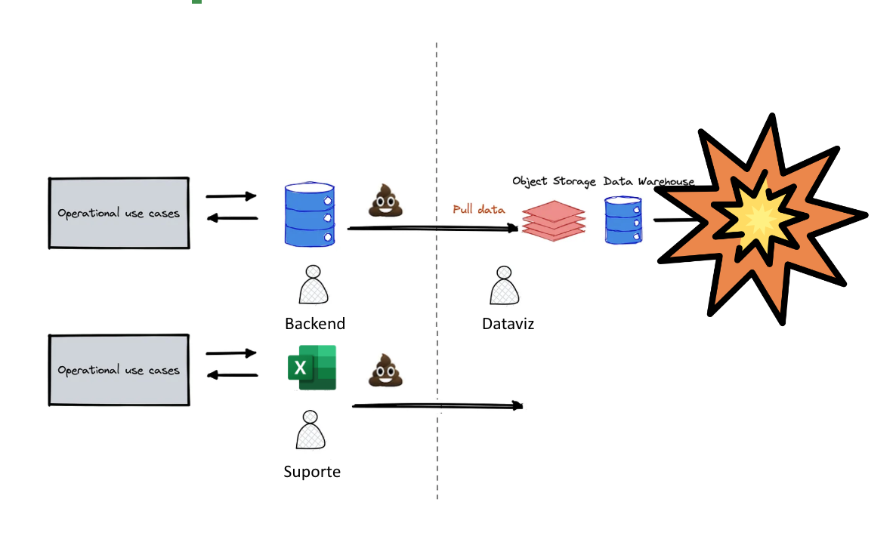
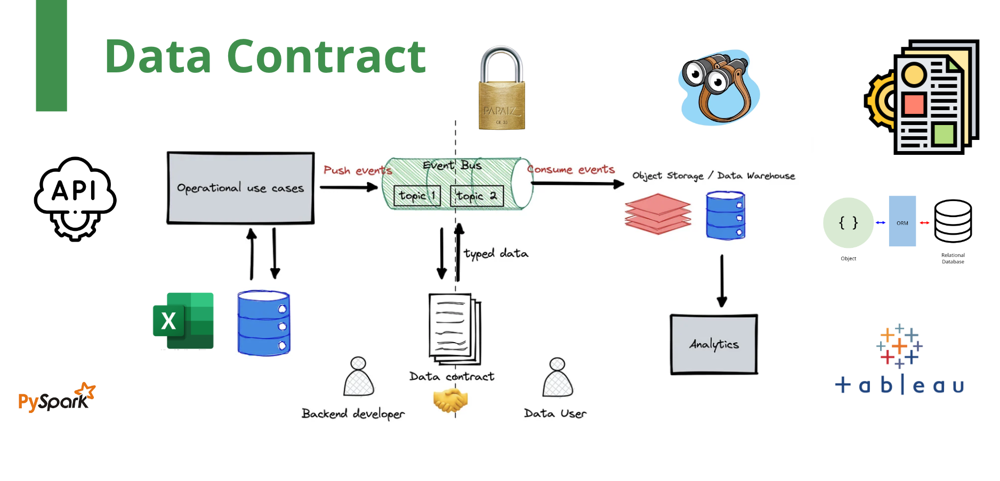
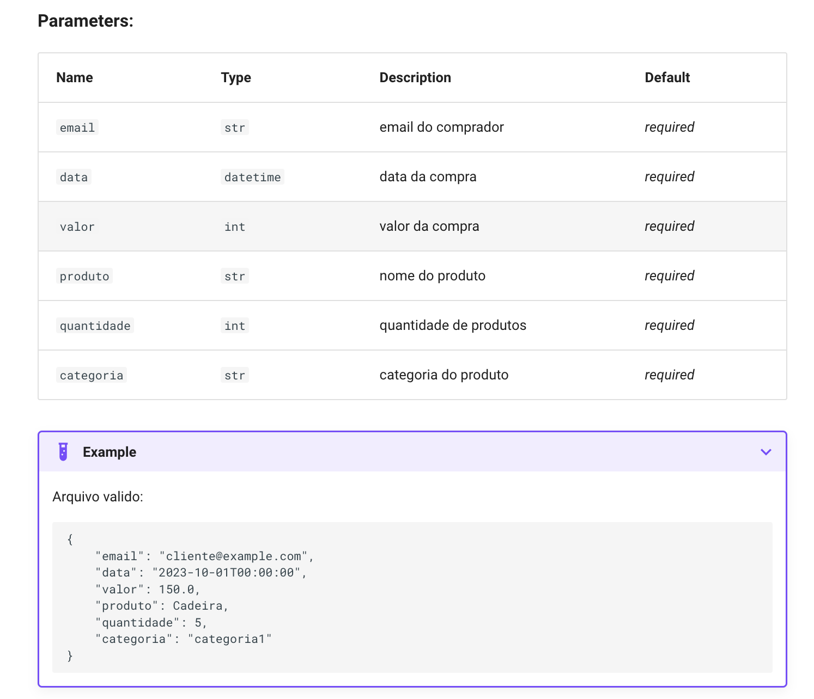

# Evitando que o seu PowerBI Exploda

Workshop: Data Saturday Vitória-ES 28/10 de 2023
Apresentação: [link](https://docs.google.com/presentation/d/1yCcScgyPux4DVa_JOgLCrqHhX0h2IUSYtdDSF0A7fMY/edit?usp=sharing)

## Introdução

Em um mundo inundado de dados, a necessidade de manter a integridade dos dados ao realizar análises é mais crucial do que nunca. "Evitando que o seu PowerBI Exploda" nasceu da necessidade de assegurar que os dados alimentados em nossos sistemas de Business Intelligence (BI) sejam precisos, consistentes e confiáveis. Erros nos dados podem causar não apenas falhas no sistema, mas também decisões empresariais errôneas com consequências graves.



Este projeto utiliza o poder do Pydantic para definir contratos de dados (também conhecidos como modelos ou esquemas) que estabelecem regras claras e rigorosas para a validação de dados. Ao assegurar que cada ponto de dados adira estritamente a um modelo bem definido, aumentamos a confiabilidade das análises e relatórios produzidos pelo PowerBI.



## Objetivo

O principal objetivo deste projeto é criar um sistema de validação de dados robusto e fácil de usar que proteja contra a integração de dados imprecisos ou formatados incorretamente. Ao fazer isso, salvaguardamos a integridade dos processos de análise subsequentes e garantimos que as decisões baseadas nesses dados sejam tomadas com confiança.

## Contratos de Dados com Pydantic

Utilizamos o Pydantic para definir estruturas claras e concisas, conhecidas como "contratos de dados", que cada conjunto de dados deve seguir. Esses contratos são modelos que especificam os tipos de dados esperados, formatos e outras regras de validação. Eles são a espinha dorsal da nossa validação, garantindo que apenas dados que atendam a esses critérios rigorosos sejam aceitos pelo nosso sistema.

Por exemplo, aqui está como um contrato de dados é definido para uma entrada de dados de vendas:

```python
from pydantic import BaseModel, EmailStr, conint, confloat

class Vendas(BaseModel):
    email: EmailStr
    quantidade: conint(gt=0)
    valor: confloat(gt=0)
    # ... outros campos com validações específicas
```

Este modelo garante que o campo de e-mail seja válido, que a quantidade e o valor sejam inteiros e flutuantes positivos, respectivamente, e assim por diante.

## Documentação com MkDocs

Para manter nossos processos transparentes e acessíveis, utilizamos o MkDocs, uma ferramenta de documentação rápida e eficaz. Com MkDocs, podemos criar uma documentação abrangente para nossos contratos de dados, incluindo descrições de campos, tipos de dados esperados e exemplos de dados válidos e inválidos.



A documentação é uma parte vital do nosso compromisso com a clareza e a acessibilidade, proporcionando uma referência rápida e confiável para todos os membros da equipe.

## Validação em Tempo Real com Streamlit

Além disso, integramos o Streamlit, uma aplicação para criar interfaces de usuário customizáveis, que permite que os usuários carreguem conjuntos de dados e recebam feedback imediato sobre a validade de seus dados em relação aos nossos contratos. Isso simplifica o processo de garantir que os dados estejam prontos para análise antes mesmo de chegar ao PowerBI.

## Validando a Pipeline de Dados

Nossa pipeline de dados também passa por validação rigorosa. Cada etapa, desde a ingestão até o armazenamento de dados, é construída com verificações de erro robustas. Isso garante que os dados não sejam apenas precisos quando entram no sistema, mas que mantenham sua integridade a cada passo do caminho.